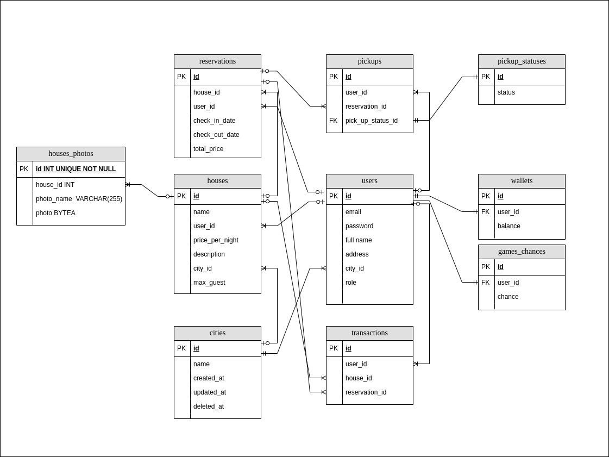

## Papikos Background

Papikos is a house/condo booking application where users can rent houses rented by Hosts.
Users can request to be a host to be able to register their house that they want to rent.

---

## Papikos Database ERD

---

## Dependencies

~~~
go get -u github.com/gin-gonic/gin
go get -u gorm.io/gorm
go get -u gorm.io/driver/sqlite
go get -u gorm.io/driver/postgres
go get -u golang.org/x/crypto/...
go get -u github.com/golang-jwt/jwt/v4
go get github.com/stretchr/testify
go install github.com/vektra/mockery/v2@latest
~~~

---

## Documentation

[http://localhost:8080/docs](http://localhost:8080/docs)  
[http://papikos-api.herokuapp.com/docs](http://papikos-api.herokuapp.com/docs)

---

Muhammad Rasyid Gatra Wijaya - rasyid.wijaya@shopee.com
